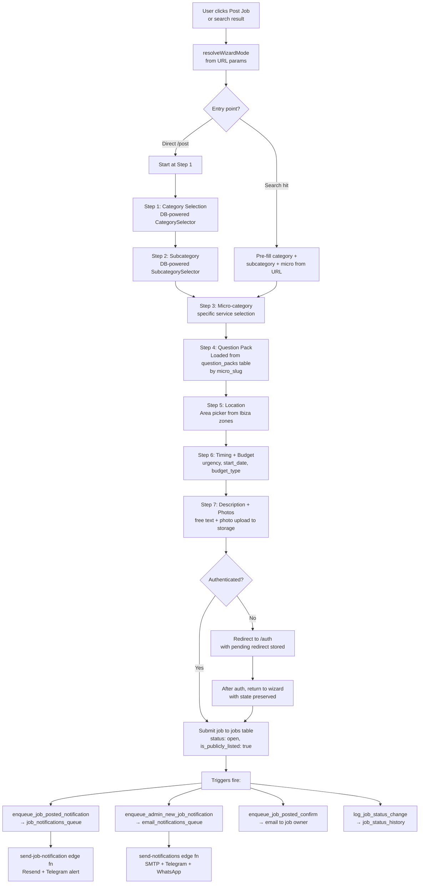
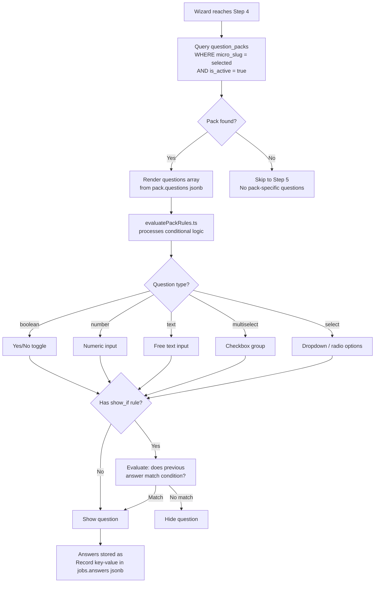
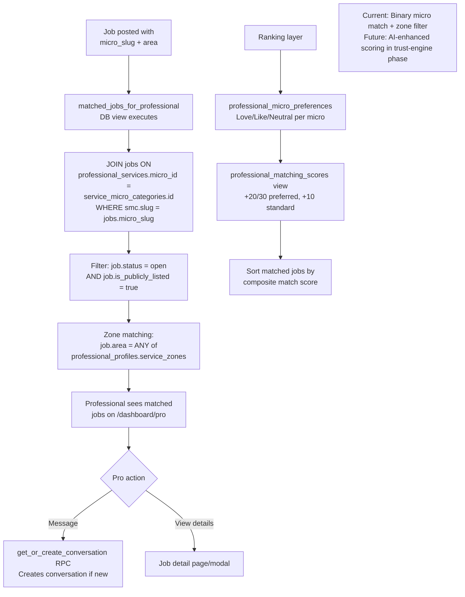
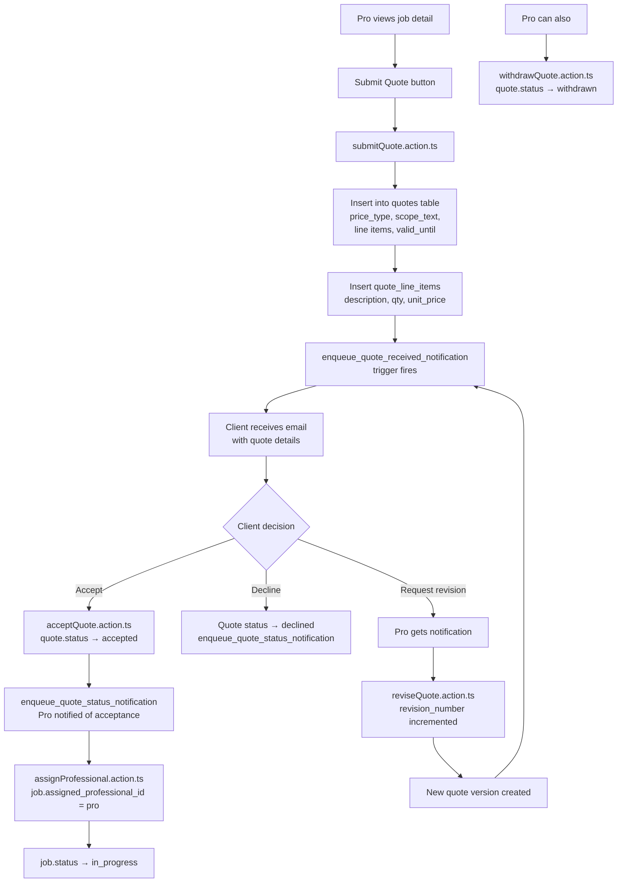
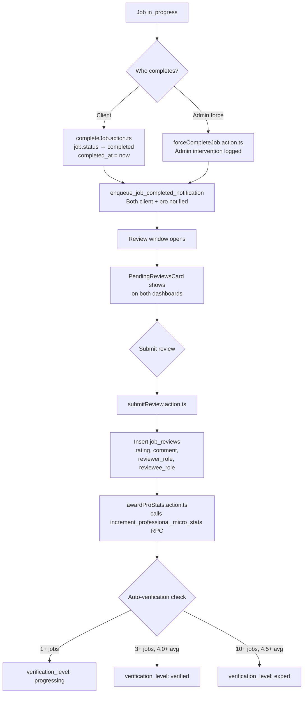
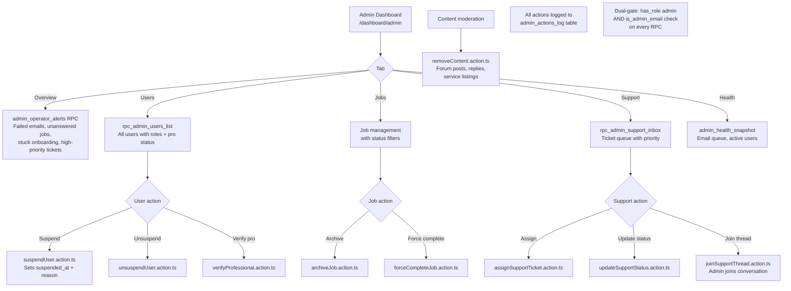

# Technical Architecture — Live Codebase Reference

**Generated from:** Actual codebase analysis (March 2026)
**Status:** Reflects production code, not idealised design

---

## 1. System Architecture

```
┌──────────────────────────────────────────────────────────────────────┐
│                       FRONTEND (React 18 + Vite + TypeScript)        │
│                                                                      │
│  ┌──────────┐ ┌───────────┐ ┌──────────┐ ┌───────┐ ┌─────────────┐ │
│  │ Wizard   │ │ Dashboards│ │ Messages │ │ Forum │ │ Admin       │ │
│  │ Canonical│ │ Client/Pro│ │ Realtime │ │ CRUD  │ │ Cockpit     │ │
│  │ 7-step   │ │ Role-based│ │ WS subs  │ │ Public│ │ 14+ RPCs    │ │
│  └────┬─────┘ └─────┬─────┘ └────┬─────┘ └───┬───┘ └──────┬──────┘ │
│       │              │            │           │             │        │
│  ┌────┴──────────────┴────────────┴───────────┴─────────────┴──────┐ │
│  │              GUARD LAYER (src/guard/)                            │ │
│  │  RouteGuard → checkAccess() → RolloutGate (6 phases)            │ │
│  │  AccessRules: public | auth | role:client | role:professional   │ │
│  │               | proReady | admin                                │ │
│  └──────────────────────────┬─────────────────────────────────────┘ │
│                             │                                       │
│  ┌──────────────────────────┴─────────────────────────────────────┐ │
│  │           STATE & DATA LAYER                                    │ │
│  │  useSessionSnapshot ─── single auth + roles + pro profile       │ │
│  │  React Query ─────────── staleTime-based caching                │ │
│  │  Supabase Realtime ───── messages channel (WS)                  │ │
│  │  i18next ─────────────── EN/ES, namespace-based                 │ │
│  └──────────────────────────┬─────────────────────────────────────┘ │
└─────────────────────────────┼───────────────────────────────────────┘
                              │ HTTPS / WSS
                              ▼
┌──────────────────────────────────────────────────────────────────────┐
│                    LOVABLE CLOUD (Supabase)                          │
│                                                                      │
│  ┌──────────┐  ┌──────────────┐  ┌──────────┐  ┌─────────────────┐ │
│  │  Auth     │  │  Database    │  │ Realtime │  │ Storage         │ │
│  │  Email    │  │  Postgres 15 │  │ WS pub/  │  │ professional-   │ │
│  │  sign-up  │  │  30+ tables  │  │ sub      │  │ documents/      │ │
│  │  + login  │  │  RLS on all  │  │ messages │  │ job-photos/     │ │
│  └──────────┘  └──────┬───────┘  └──────────┘  └─────────────────┘ │
│                       │                                              │
│  ┌────────────────────┴─────────────────────────────────────────┐   │
│  │              DATABASE FUNCTIONS (30+)                         │   │
│  │                                                               │   │
│  │  SECURITY:    has_role(), is_admin_email(), check_rate_limit() │   │
│  │  ADMIN RPCs:  rpc_admin_platform_stats, rpc_admin_users_list  │   │
│  │               rpc_admin_support_inbox, admin_health_snapshot   │   │
│  │               admin_operator_alerts, admin_metric_timeseries  │   │
│  │               admin_metric_drilldown, admin_market_gap        │   │
│  │               admin_top_sources, admin_onboarding_funnel      │   │
│  │               admin_messaging_pulse                           │   │
│  │  TRIGGERS:    enqueue_message_notification                    │   │
│  │               enqueue_job_posted_notification                 │   │
│  │               enqueue_welcome_email                           │   │
│  │               enqueue_admin_new_job_notification              │   │
│  │               enqueue_admin_new_user_notification             │   │
│  │               enqueue_pro_signup_notification                 │   │
│  │               enqueue_support_ticket_notification             │   │
│  │               enqueue_quote_received_notification             │   │
│  │               enqueue_quote_status_notification               │   │
│  │               enqueue_job_completed_notification              │   │
│  │               enqueue_forum_post_notification                 │   │
│  │               enqueue_bug_report_notification                 │   │
│  │               enqueue_job_posted_confirm                      │   │
│  │               log_job_status_change (audit trail)             │   │
│  │  DOMAIN:      get_or_create_conversation                     │   │
│  │               create_direct_conversation                      │   │
│  │               switch_active_role                              │   │
│  │               increment_professional_micro_stats              │   │
│  │               create_draft_service_listings                   │   │
│  │               get_conversations_with_unread                   │   │
│  │  CRON:        purge_stale_telemetry (daily)                  │   │
│  └───────────────────────────────────────────────────────────────┘   │
│                                                                      │
│  ┌───────────────────────────────────────────────────────────────┐   │
│  │              EDGE FUNCTIONS (13)                               │   │
│  │                                                               │   │
│  │  send-notifications ──── Multi-channel fan-out (SMTP+TG+WA)  │   │
│  │  send-job-notification ─ Resend + Telegram job alerts         │   │
│  │  send-auth-email ─────── Custom auth email templates          │   │
│  │  collect-attribution ─── UTM/referrer binding to user         │   │
│  │  translate-content ───── i18n translation via AI              │   │
│  │  search-stock-photos ─── Stock photo search proxy             │   │
│  │  update-user-email ───── Email change flow                    │   │
│  │  weekly-kpi-digest ───── Scheduled KPI email to admin         │   │
│  │  backfill-translations ─ Batch translation worker             │   │
│  │  seedpacks ───────────── DB seeding utility                   │   │
│  │  seed-electrical ─────── Category-specific seeder             │   │
│  │  ping ────────────────── Health check endpoint                │   │
│  └───────────────────────────────────────────────────────────────┘   │
└──────────────────────────────────────────────────────────────────────┘
                              │
                              ▼
┌──────────────────────────────────────────────────────────────────────┐
│              EXTERNAL SERVICES                                       │
│                                                                      │
│  Krystal SMTP ──── Transactional email delivery                      │
│  Resend ────────── Job notification email (send-job-notification)     │
│  Telegram Bot ──── Admin alerts (new jobs, signups, support)          │
│  CallMeBot ─────── WhatsApp admin alerts                             │
└──────────────────────────────────────────────────────────────────────┘

┌──────────────────────────────────────────────────────────────────────┐
│              NOT YET IMPLEMENTED                                     │
│                                                                      │
│  Stripe ────────── Payments / Protection (designed, not built)         │
│  AI Matching ───── Enhanced scoring (planned for trust-engine phase)  │
│  Push Notifs ───── Beyond email/WA/Telegram (future)                  │
│  CDN ───────────── Static assets / listing images (future)            │
└──────────────────────────────────────────────────────────────────────┘
```

---

## 2. Module Ownership Map

### Auth
| Layer | Owner |
|-------|-------|
| Session management | `src/hooks/useSessionSnapshot.ts` |
| Auth pages | `src/pages/auth/` |
| Auth callback | `src/pages/auth/AuthCallback.tsx` |
| Route protection | `src/guard/RouteGuard.tsx` → `src/guard/access.ts` |
| Public-only guard | `src/guard/redirects.ts` |
| Custom auth emails | `supabase/functions/send-auth-email/` |
| Email change | `supabase/functions/update-user-email/` |

### Roles
| Layer | Owner |
|-------|-------|
| DB table | `user_roles` (roles[], active_role) |
| Server validation | `has_role()` SQL function (SECURITY DEFINER) |
| Role switching | `switch_active_role()` RPC |
| Client switching | `useSessionSnapshot.switchRole()` |
| UI component | `src/shared/components/layout/RoleSwitcher.tsx` |
| Access rules | `src/guard/access.ts` — `checkAccess()` |

### Profiles
| Layer | Owner |
|-------|-------|
| General profile | `profiles` table (display_name, phone, attribution) |
| Professional profile | `professional_profiles` table (full pro data) |
| Profile editing | `src/pages/professional/ProfileEdit.tsx` |
| Settings | `src/pages/settings/Settings.tsx` |

### Service Taxonomy
| Layer | Owner |
|-------|-------|
| Categories (16) | `service_categories` table |
| Subcategories | `service_subcategories` table |
| Micro-categories | `service_micro_categories` table |
| Search index | `service_search_index` view (denormalized) |
| Category translations | `src/i18n/categoryTranslations.ts` |
| DB-powered selectors | `src/features/wizard/db-powered/` |
| Seeding | `supabase/functions/seedpacks/`, `seed-electrical/` |

### Wizard Engine
| Layer | Owner |
|-------|-------|
| Core wizard | `src/features/wizard/canonical/` (steps/, hooks/, lib/) |
| URL builder | `src/features/wizard/lib/wizardLink.ts` |
| Pack rules | `src/features/wizard/lib/evaluatePackRules.ts` |
| Question packs | `question_packs` table (one per micro_slug) |
| Question queries | `src/pages/jobs/queries/questionPacks.query.ts` |
| Post page | `src/pages/jobs/PostJob.tsx` |
| Validation | `src/pages/jobs/validators.ts` |

### Job Requests / Job Cards
| Layer | Owner |
|-------|-------|
| DB table | `jobs` (30+ columns including i18n, attribution, flags) |
| Board view | `jobs_board` DB view |
| Detail view | `job_details` DB view (with `is_owner` flag) |
| Board page | `src/pages/jobs/JobBoardPage.tsx` |
| Detail page | `src/pages/jobs/JobDetailsPage.tsx` |
| Detail modal | `src/pages/jobs/JobDetailsModal.tsx` |
| Board query | `src/pages/jobs/queries/jobBoard.query.ts` |
| Detail query | `src/pages/jobs/queries/jobDetails.query.ts` |
| Types | `src/pages/jobs/types.ts` |
| Client dashboard | `src/pages/dashboard/client/ClientDashboard.tsx` |
| Client job card | `src/pages/dashboard/client/components/ClientJobCard.tsx` |
| Status history | `job_status_history` table + `log_job_status_change()` trigger |

### Matching
| Layer | Owner |
|-------|-------|
| Match view | `matched_jobs_for_professional` DB view |
| Match query | `src/pages/jobs/queries/matchedJobs.query.ts` |
| Match hook | `src/hooks/useMatchedJobs.ts` |
| Pro services | `professional_services` table (binary IN/OUT) |
| Micro stats | `professional_micro_stats` table |
| Preferences | `professional_micro_preferences` table |
| Priorities UI | `src/pages/professional/JobPriorities.tsx` |
| Scoring view | `professional_matching_scores` DB view |

### Quotes
| Layer | Owner |
|-------|-------|
| DB tables | `quotes`, `quote_line_items` |
| Submit action | `src/pages/jobs/actions/submitQuote.action.ts` |
| Revise action | `src/pages/jobs/actions/reviseQuote.action.ts` |
| Accept action | `src/pages/jobs/actions/acceptQuote.action.ts` |
| Withdraw action | `src/pages/jobs/actions/withdrawQuote.action.ts` |
| Quotes query | `src/pages/jobs/queries/quotes.query.ts` |
| Notification triggers | `enqueue_quote_received_notification()`, `enqueue_quote_status_notification()` |

### Assignments
| Layer | Owner |
|-------|-------|
| Assign action | `src/pages/jobs/actions/assignProfessional.action.ts` |
| Assign selector | `src/pages/dashboard/shared/components/AssignProSelector.tsx` |
| Complete action | `src/pages/jobs/actions/completeJob.action.ts` |
| Stats award | `src/pages/jobs/actions/awardProStats.action.ts` |

### Messaging
| Layer | Owner |
|-------|-------|
| DB tables | `conversations`, `messages`, `conversation_participants` |
| Realtime | Supabase Realtime on `messages` |
| Pages | `src/pages/messages/Messages.tsx`, `ConversationList.tsx`, `ConversationThread.tsx` |
| Create convo | `get_or_create_conversation()`, `create_direct_conversation()` RPCs |
| Unread counts | `get_conversations_with_unread()` RPC |
| Message action | `src/pages/jobs/actions/messageJob.action.ts` |
| Notifications | `enqueue_message_notification()` trigger (debounced) |
| Message alerts | `src/hooks/useMessageNotifications.ts` |

### Reviews
| Layer | Owner |
|-------|-------|
| DB table | `job_reviews` (bidirectional: client↔pro) |
| Submit action | `src/pages/jobs/actions/submitReview.action.ts` |
| Pending reviews | `src/pages/dashboard/shared/components/PendingReviewsCard.tsx` |
| Pending hook | `src/pages/dashboard/shared/hooks/usePendingReviews.ts` |
| Stats update | `increment_professional_micro_stats()` RPC |

### Payments / Payment Protection
| Layer | Owner |
|-------|-------|
| **NOT IMPLEMENTED** | Designed for `protection-beta` rollout phase |
| Route registry | V2 EXCLUDED block in `registry.ts` (lines 274-279) |
| Current phase | `founding-members` — 2 phases before payment protection |

### Notifications
| Layer | Owner |
|-------|-------|
| Email queue | `email_notifications_queue` table (attempts, dead-letter) |
| Job queue | `job_notifications_queue` table |
| Fan-out worker | `supabase/functions/send-notifications/` |
| Job notifications | `supabase/functions/send-job-notification/` |
| 13 trigger functions | `enqueue_*` functions (see DB Functions above) |
| Preferences | `notification_preferences` table |
| KPI digest | `supabase/functions/weekly-kpi-digest/` |
| Job alerts hook | `src/hooks/useJobAlerts.ts` |

### Admin
| Layer | Owner |
|-------|-------|
| Dashboard | `src/pages/admin/AdminDashboard.tsx` |
| Layout | `src/pages/admin/AdminRouteLayout.tsx` |
| Drawer context | `src/pages/admin/context/` |
| Sections | `src/pages/admin/sections/` (Users, Jobs, Content, Support) |
| Insights | `src/pages/admin/insights/` (10 insight pages) |
| Monitoring | `src/pages/admin/monitoring/` (Messaging Pulse) |
| 14+ RPCs | `rpc_admin_*` functions (all SECURITY DEFINER + dual-gate) |
| Actions | `src/pages/admin/actions/` (9 action files) |
| Hooks | `src/pages/admin/hooks/` |

### Logs / Audit
| Layer | Owner |
|-------|-------|
| Admin actions | `admin_actions_log` table |
| Job status | `job_status_history` table + `log_job_status_change()` |
| Analytics | `analytics_events` table + `track_event()` RPC |
| Page views | `page_views` table |
| Errors | `error_events` table |
| Network failures | `network_failures` table |
| Rate limiting | `rate_limit_events` table |
| Attribution | `attribution_sessions` table |
| Telemetry purge | `purge_stale_telemetry()` via pg_cron |

---

## 3. Database Relationship Map (ERD)

### Core Tables & Relationships

```
┌──────────────────────┐      ┌──────────────────────────┐
│     auth.users       │      │       profiles            │
│ (Supabase-managed)   │◄────▶│  user_id (unique)         │
│                      │      │  display_name, phone       │
│                      │      │  first/last_touch_attrib   │
└──────────┬───────────┘      └──────────────────────────┘
           │
           │ user_id
           ▼
┌──────────────────────┐      ┌──────────────────────────┐
│     user_roles       │      │  professional_profiles    │
│  user_id (unique)    │      │  user_id (unique)         │
│  roles text[]        │      │  display_name             │
│  active_role text    │      │  business_name, bio       │
│  suspended_at        │      │  onboarding_phase *       │
│  suspension_reason   │      │  verification_status *    │
└──────────────────────┘      │  service_zones text[]     │
                              │  is_publicly_listed       │
                              │  services_count           │
                              │  hourly_rate_min/max      │
                              │  day_rate                 │
                              │  accepts_emergency        │
                              │  pricing_model            │
                              │  working_hours jsonb      │
                              │  base_location jsonb      │
                              └─────────┬────────────────┘
                                        │ user_id
                                        ▼
                              ┌──────────────────────────┐
                              │  professional_services    │
                              │  user_id + micro_id       │
                              │  status (offered/paused)  │
                              │  notify, searchable       │
                              └─────────┬────────────────┘
                                        │ micro_id
                                        ▼
┌──────────────────────┐      ┌──────────────────────────┐
│  service_categories  │◄─────│  service_subcategories    │
│  16 groups           │      │  category_id FK           │
│  slug, name          │      │  slug, name               │
│  icon_emoji          │      │  icon_emoji               │
│  category_group      │      └─────────┬────────────────┘
│  is_featured         │                │ subcategory_id
└──────────────────────┘                ▼
                              ┌──────────────────────────┐
                              │ service_micro_categories  │
                              │  subcategory_id FK        │
                              │  slug, name               │
                              │  is_active                │
                              └──────────────────────────┘

┌──────────────────────────────────────────────────────────────────┐
│                          JOBS CLUSTER                            │
│                                                                  │
│  ┌──────────────────────┐      ┌──────────────────────────┐     │
│  │        jobs           │      │    job_status_history     │     │
│  │  id (PK)              │◄────▶│  job_id FK               │     │
│  │  user_id              │      │  from_status, to_status   │     │
│  │  title, description   │      │  changed_by, source       │     │
│  │  category, subcategory│      └──────────────────────────┘     │
│  │  micro_slug           │                                       │
│  │  area                 │      ┌──────────────────────────┐     │
│  │  status *             │◄────▶│    job_invites            │     │
│  │  location jsonb       │      │  job_id FK               │     │
│  │  answers jsonb        │      │  professional_id          │     │
│  │  attribution jsonb    │      │  status, message          │     │
│  │  title_i18n jsonb     │      └──────────────────────────┘     │
│  │  description_i18n     │                                       │
│  │  teaser_i18n jsonb    │      ┌──────────────────────────┐     │
│  │  budget_type/value    │◄────▶│    quotes                 │     │
│  │  budget_min/max       │      │  job_id FK               │     │
│  │  start_date/timing    │      │  professional_id          │     │
│  │  flags text[]         │      │  price_type, price_fixed   │     │
│  │  highlights text[]    │      │  price_min, price_max      │     │
│  │  has_photos           │      │  scope_text               │     │
│  │  is_publicly_listed   │      │  status *                 │     │
│  │  is_custom_request    │      │  revision_number          │     │
│  │  computed_safety      │      │  valid_until              │     │
│  │  computed_insp_bias   │      │  vat_percent              │     │
│  │  edit_version         │      │  subtotal, total           │     │
│  │  translation_status   │      └─────────┬────────────────┘     │
│  │  source_lang          │                │                       │
│  │  assigned_pro_id      │      ┌─────────┴────────────────┐     │
│  │  completed_at         │      │  quote_line_items         │     │
│  └──────────┬────────────┘      │  quote_id FK             │     │
│             │                   │  description, qty, price  │     │
│             │ job_id            │  sort_order               │     │
│             ▼                   └──────────────────────────┘     │
│  ┌──────────────────────┐                                        │
│  │    conversations      │      ┌──────────────────────────┐     │
│  │  job_id FK            │◄────▶│    messages               │     │
│  │  client_id            │      │  conversation_id FK       │     │
│  │  pro_id               │      │  sender_id               │     │
│  │  last_message_at      │      │  body, message_type       │     │
│  │  last_message_preview │      │  metadata jsonb           │     │
│  │  last_read_at_client  │      └──────────────────────────┘     │
│  │  last_read_at_pro     │                                       │
│  │  UNIQUE(job,client,pro│      ┌──────────────────────────┐     │
│  └──────────────────────┘◄────▶│  conversation_participants │     │
│                                 │  conversation_id FK       │     │
│  ┌──────────────────────┐      │  user_id, role_in_convo    │     │
│  │    job_reviews        │      └──────────────────────────┘     │
│  │  job_id FK            │                                       │
│  │  reviewer_user_id     │                                       │
│  │  reviewee_user_id     │                                       │
│  │  reviewer_role        │                                       │
│  │  reviewee_role        │                                       │
│  │  rating (1-5)         │                                       │
│  │  comment, visibility  │                                       │
│  └──────────────────────┘                                        │
└──────────────────────────────────────────────────────────────────┘

┌──────────────────────────────────────────────────────────────────┐
│                    SERVICE LISTINGS CLUSTER                       │
│                                                                  │
│  ┌──────────────────────┐      ┌──────────────────────────┐     │
│  │  service_listings     │◄────▶│  service_pricing_items   │     │
│  │  provider_id          │      │  service_listing_id FK   │     │
│  │  micro_id FK          │      │  label, price_amount     │     │
│  │  display_title        │      │  unit, sort_order         │     │
│  │  display_title_i18n   │      └──────────────────────────┘     │
│  │  short_description    │                                       │
│  │  hero_image_url       │      ┌──────────────────────────┐     │
│  │  gallery text[]       │◄────▶│  service_views            │     │
│  │  status *             │      │  service_listing_id FK    │     │
│  │  published_at         │      │  viewer_user_id           │     │
│  │  UNIQUE(provider,micro│      │  session_id               │     │
│  └──────────────────────┘      └──────────────────────────┘     │
└──────────────────────────────────────────────────────────────────┘

┌──────────────────────────────────────────────────────────────────┐
│                    SUPPORT CLUSTER                                │
│                                                                  │
│  ┌──────────────────────┐      ┌──────────────────────────┐     │
│  │  support_requests     │◄────▶│  support_request_events  │     │
│  │  ticket_number (auto) │      │  support_request_id FK   │     │
│  │  job_id FK (optional) │      │  event_type              │     │
│  │  conversation_id FK   │      │  actor_user_id/role      │     │
│  │  issue_type           │      │  metadata jsonb           │     │
│  │  summary              │      └──────────────────────────┘     │
│  │  status, priority     │                                       │
│  │  assigned_to          │                                       │
│  └──────────────────────┘                                        │
└──────────────────────────────────────────────────────────────────┘
```

### Status Enums (Canonical Values)

| Entity | Statuses |
|--------|----------|
| **Job** | `draft`, `open`, `in_review`, `live`, `locked`, `in_progress`, `completed`, `cancelled`, `disputed` |
| **Quote** | `submitted`, `revised`, `accepted`, `rejected`, `withdrawn` |
| **Professional verification** | `unverified`, `pending`, `verified`, `rejected` |
| **Onboarding phase** | `not_started`, `basic_info`, `service_area`, `service_setup`, `complete` |
| **Service listing** | `draft`, `live`, `paused` |
| **Support ticket** | `open`, `triage`, `in_progress`, `resolved`, `closed` |
| **Pro micro stats level** | `unverified`, `progressing`, `verified`, `expert` |

### Key Indexes (Created)

| Index | Table | Columns |
|-------|-------|---------|
| `idx_jobs_status_created_at` | jobs | (status, created_at DESC) |
| `idx_messages_conversation_created` | messages | (conversation_id, created_at DESC) |
| `idx_jobs_micro_slug` | jobs | (micro_slug) WHERE NOT NULL |
| `idx_conversations_unique_triple` | conversations | UNIQUE(job_id, client_id, pro_id) |

### JSON Fields (Non-trivial)

| Table | Column | Structure |
|-------|--------|-----------|
| jobs | `location` | `{area: string, coordinates?: {lat, lng}, zone?: string}` |
| jobs | `answers` | Dynamic: keyed by question_pack field IDs |
| jobs | `attribution` | `{session_id, utm_source, utm_medium, ...}` |
| jobs | `*_i18n` | `{en: string, es: string}` |
| professional_profiles | `working_hours` | `{mon: {start, end}, tue: ...}` |
| professional_profiles | `base_location` | `{area, coordinates}` |
| professional_profiles | `metadata` | Flexible key-value store |
| question_packs | `questions` | Array of question definitions with types/options |

### Source-of-Truth Tables

| Concern | Table | Notes |
|---------|-------|-------|
| User identity | `auth.users` | Supabase-managed, never queried directly |
| User roles | `user_roles` | Single row per user, roles[] array |
| Service taxonomy | `service_categories/subcategories/micro_categories` | 3-tier, slug-based |
| Job state | `jobs` + `job_status_history` | Status field + full audit trail |
| Pro capability | `professional_services` | Binary IN/OUT per micro_id |
| Pro reputation | `professional_micro_stats` | Per-micro completion/rating stats |
| Admin allowlist | `admin_allowlist` | Email-based admin gate |

---

## 4. Lifecycle Flowcharts

### 4.1 Signup & Automatic Role Creation

```mermaid
flowchart TD
    A[User visits /auth] --> B{Sign up or Sign in?}
    B -->|Sign up| C[Email + password form]
    C --> D[Supabase auth.signUp]
    D --> E[Email verification sent]
    E --> F[User clicks verify link]
    F --> G[/auth/callback handles token]
    G --> H[DB trigger creates profile row]
    H --> I[DB trigger creates user_roles<br/>roles: client, active_role: client]
    I --> J[enqueue_welcome_email trigger fires]
    J --> K[enqueue_admin_new_user_notification fires]
    K --> L{Intent = professional?}
    L -->|Yes| M[Add professional to roles array<br/>Create professional_profiles row<br/>onboarding_phase: not_started]
    L -->|No| N[Redirect to homepage /]
    M --> O[Redirect to /onboarding/professional]

    B -->|Sign in| P[Email + password form]
    P --> Q[Supabase auth.signInWithPassword]
    Q --> R[useSessionSnapshot loads<br/>roles + pro profile in parallel]
    R --> S{active_role?}
    S -->|client| N
    S -->|professional| T{onboarding complete?}
    T -->|No| O
    T -->|Yes| U[Redirect to /dashboard/pro]
    S -->|admin| V[Redirect to /dashboard/admin]
```

### 4.2 Professional Onboarding & Verification

```mermaid
flowchart TD
    A[/onboarding/professional] --> B[Phase: basic_info]
    B --> C[Display name, business name,<br/>phone, bio, avatar upload]
    C --> D[Save to professional_profiles]
    D --> E[Phase: service_area]
    E --> F[Select service zones<br/>Ibiza zone picker from zones.ts]
    F --> G[Set service_radius_km,<br/>service_area_type]
    G --> H[Phase: service_setup]
    H --> I[DB-powered category accordion<br/>Binary IN/OUT micro selection]
    I --> J[Insert rows into<br/>professional_services table]
    J --> K[create_draft_service_listings RPC<br/>creates draft listings per micro]
    K --> L[Phase: complete]
    L --> M[enqueue_pro_signup_notification<br/>Admin alerted via Telegram + WA]
    M --> N{Verification}
    N --> O[verification_status: pending]
    O --> P[Admin reviews via dashboard]
    P --> Q{Decision}
    Q -->|Approve| R[verifyProfessional.action.ts<br/>status: verified]
    Q -->|Reject| S[status: rejected]
    R --> T[Pro visible in directory<br/>is_publicly_listed: true]
    
    note1[enforce_pro_public_listing_guard<br/>trigger prevents listing<br/>if onboarding != complete]
```

### 4.3 Client Job Posting Wizard



### 4.4 Conditional Question Branching



### 4.5 Matching Engine (Current Implementation)



### 4.6 Quote Submission & Acceptance



### 4.7 Job Completion & Review Flow



### 4.8 Admin Moderation & Dispute Flow



### 4.9 Payment Protection Lifecycle (DESIGNED, NOT BUILT)

```
Status: NOT IMPLEMENTED
Rollout phase: protection-beta (2 phases away)
Route registry: V2 EXCLUDED block (lines 274-279)

Planned flow:
  Quote accepted → Payment created → Client funds milestone
  → Pro completes work → Client approves → Funds released
  → Dispute path if disagreement

No code exists for this flow. No tables, no edge functions, no UI.
```

---

## 5. Risk Notes

### 5.1 Hardcoded Logic That Should Be Config-Driven

| Location | Issue | Risk Level |
|----------|-------|------------|
| `rollout.ts` line 34 | `CURRENT_ROLLOUT` is a hardcoded constant | **Low** — intentional for now, but should move to DB or env var at scale |
| `send-notifications` | SMTP credentials, Telegram bot token hardcoded as env vars | **Low** — correctly uses secrets, but no rotation mechanism |
| `increment_professional_micro_stats` | Verification thresholds (1/3/10 jobs, 4.0/4.5 rating) hardcoded in SQL | **Medium** — changing thresholds requires a migration |
| `admin_operator_alerts` | Alert thresholds (6h unanswered, 6h stuck onboarding) hardcoded | **Medium** — should be configurable per admin preference |
| `check_rate_limit` | Rate limit windows passed as function params — good pattern | **Low** — already parameterised |
| Ibiza zones | `zones.ts` contains hardcoded zone list | **Medium** — adding new zones requires code deploy |

### 5.2 Tightly Coupled Areas

| Coupling | Components | Impact |
|----------|------------|--------|
| Wizard ↔ Question Packs | Wizard Step 4 assumes `question_packs` table structure | If pack schema changes, wizard rendering breaks |
| Job status ↔ 13 triggers | Every job status change fires multiple notification triggers | Adding new statuses requires auditing all trigger functions |
| `useSessionSnapshot` ↔ 3 tables | Single hook queries `user_roles` + `professional_profiles` + `profiles` | Any schema change to these tables breaks the entire auth flow |
| Admin RPCs ↔ Table structure | 14+ RPCs have hardcoded column lists | Schema changes require updating all affected RPCs |
| `send-notifications` ↔ All event types | Single 460-line function handles all notification types | Any email template change requires redeploying the entire function |

### 5.3 Scaling Risks

| Risk | Current State | Breaking Point | Mitigation |
|------|---------------|----------------|------------|
| Email throughput | Krystal SMTP, ~500/day limit | 500+ daily transactional emails | Migrate to Resend or SendGrid |
| Notification queue | Single `send-notifications` function processes all | High-volume periods could cause delays | Split into per-event-type workers |
| Matching query | `matched_jobs_for_professional` is a DB view with JOINs | 1000+ active pros × 100+ open jobs | Materialise view or add caching layer |
| Realtime connections | Supabase free tier limits WS connections | 200+ concurrent messaging users | Upgrade Supabase plan |
| `services_count` | Denormalised counter, no sync trigger | Count drifts if `professional_services` modified outside normal flow | Add trigger to recount on INSERT/DELETE |
| Admin RPCs | Each fires 4-8 separate COUNT queries | Slow with 10,000+ rows per table | Use CTEs or materialised stats |

### 5.4 Payment Risks

| Risk | Detail |
|------|--------|
| **No payment system exists** | Designed for `protection-beta` phase, currently 2 phases away |
| **No payment tables** | No financial tables, no webhook handlers, no Stripe integration |
| **Quote acceptance has no payment gate** | Accepting a quote immediately assigns the pro — no deposit required |
| **No refund mechanism** | No infrastructure for handling payment disputes |
| **Recommendation** | Do NOT build payment infrastructure until matching and messaging are validated with real transaction volume |

### 5.5 Weak Points in Matching

| Weakness | Detail | Impact |
|----------|--------|--------|
| Binary-only matching | Pro either offers a micro or doesn't — no skill level or experience weighting | A brand-new pro ranks equally to a 10-year veteran |
| Zone matching is exact string match | `job.area = ANY(service_zones)` — no proximity/radius calculation | A pro 1km outside a zone boundary won't match |
| No availability filtering | Matching doesn't check if pro is actually available | Matched pros may be fully booked |
| No response rate signal | Pros who never respond still appear in matches | Clients waste time messaging unresponsive pros |
| Preference scores are additive only | Love/Like/Neutral adds +20/30/+10 — no penalty for poor history | A pro with bad reviews but "Love" preference ranks higher than a great pro with "Neutral" |
| No geographic distance scoring | Flat zone match, no weighting by proximity | Pro 30km away ranks same as pro 2km away |

### 5.6 Weak Points in Wizard Maintainability

| Weakness | Detail |
|----------|--------|
| Question pack schema is untyped | `questions` column is `jsonb` — no DB-level validation of question structure |
| No pack versioning strategy | `version` column exists but no migration path for users mid-wizard |
| `evaluatePackRules.ts` handles all branching | Single file for all conditional logic — grows linearly with pack complexity |
| Category/subcategory/micro selection is 3 sequential DB queries | Each step waits for previous — could be a single denormalised query |
| Wizard state not persisted to DB until submit | Browser refresh or crash loses all wizard progress |
| Large component files | Canonical wizard components are ~1.2k lines — harder to test and maintain |
| No A/B testing framework | Cannot test alternative wizard flows without code changes |

---

## Appendix: File Structure Reference

```
src/
├── app/routes/
│   ├── registry.ts          # 45 route definitions
│   └── rules.ts             # AccessRule, RouteLane types
├── domain/
│   ├── models.ts            # ProblemCard, TaskerProfile, Match
│   └── rollout.ts           # 6-phase rollout system
├── features/
│   ├── wizard/
│   │   ├── canonical/       # Main wizard (steps, hooks, lib)
│   │   ├── db-powered/      # Category selectors
│   │   └── lib/             # wizardLink, evaluatePackRules
│   └── search/              # Universal search
├── guard/
│   ├── RouteGuard.tsx       # Auth + role gate wrapper
│   ├── access.ts            # checkAccess() pure function
│   ├── RolloutGate.tsx      # Phase-based feature gating
│   ├── proReadiness.ts      # Pro action gating
│   └── redirects.ts         # PublicOnlyGuard
├── hooks/
│   └── useSessionSnapshot.ts # Single source of truth for auth
├── pages/
│   ├── admin/               # 9 actions, 4 sections, 10 insights
│   ├── auth/                # Sign in/up, callback
│   ├── dashboard/client/    # Client dashboard
│   ├── dashboard/pro/       # Pro dashboard
│   ├── forum/               # Community forum
│   ├── jobs/                # 10 actions, 7 queries, components
│   ├── messages/            # Conversations + realtime
│   ├── onboarding/          # Pro onboarding (4 steps)
│   ├── professional/        # Pro management pages
│   ├── services/            # Service listings marketplace
│   └── settings/            # User settings
└── shared/components/       # Layout, EmptyState, StatTile

supabase/functions/          # 13 edge functions
supabase/migrations/         # 90+ migration files
```
